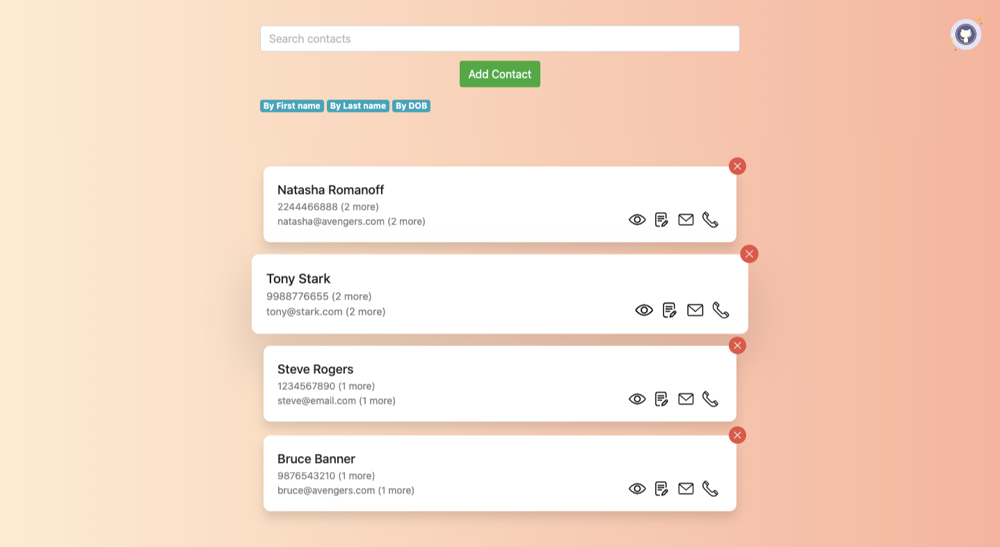

# Contacts Book

> Contacts is a responsive web app to store and manage contacts. The
> project started as a hiring challenge but I’m planning to implement
> some more features to it to make it usable in day to day life. It's developed following MVC and Publish-Subscribe design pattern in Javascript.

### Live link

https://contacts-book.netlify.app/

### Tech stack:

- Javascript-MVC
- JQuery
- Bootstrap
- CSS
- IndexedDB

### Features:

- Add/Update/Delete contacts
- Search & Sort contacts
- Email and Call contact (Depending on the native device)
- Persist state, uses IndexedDB client side storage

### Roadmap:

 - [x] Implement search & sort functionalists
 - [ ] Add validations, add more fields
 - [ ] Make mobile design more native
 - [x] Use PouchDb to persist the state in local storage
 - [ ] Sync PouchDB to cloud database (MongoDB Atlas)
 - [ ] Make the app work offline (PWA)
 - [ ] Add google authentications
 - [ ] Add animations, make interactions look beautiful
 - [ ] Use PouchDB map/reduce or Find queries for search & sort
